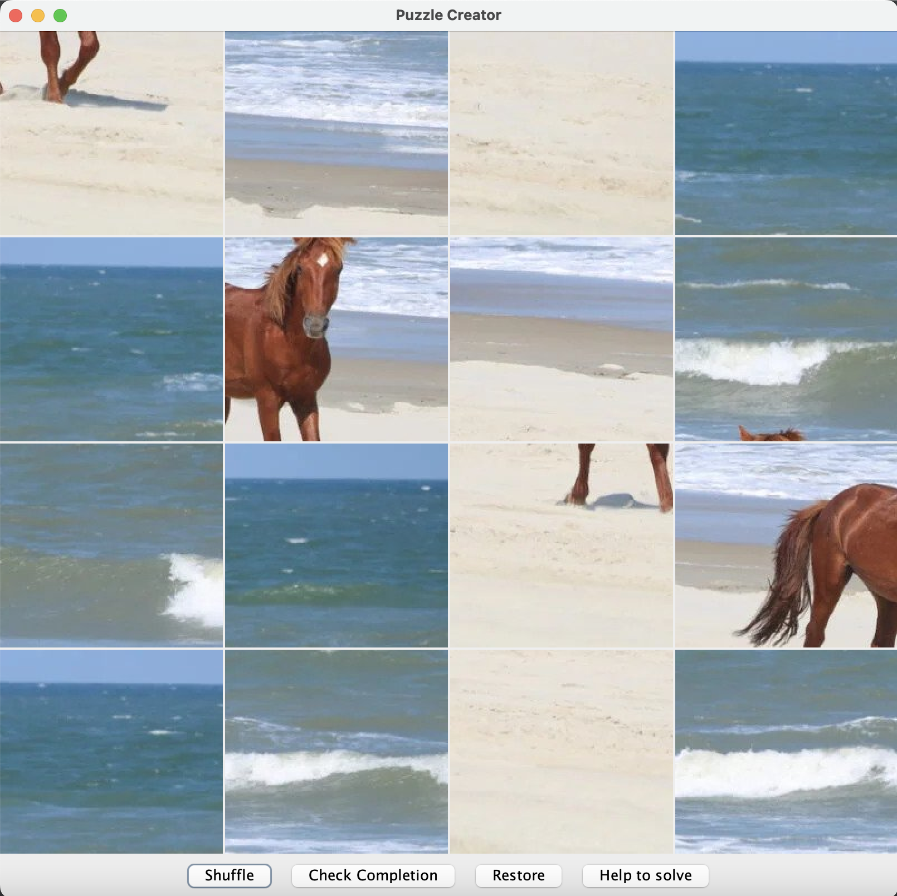
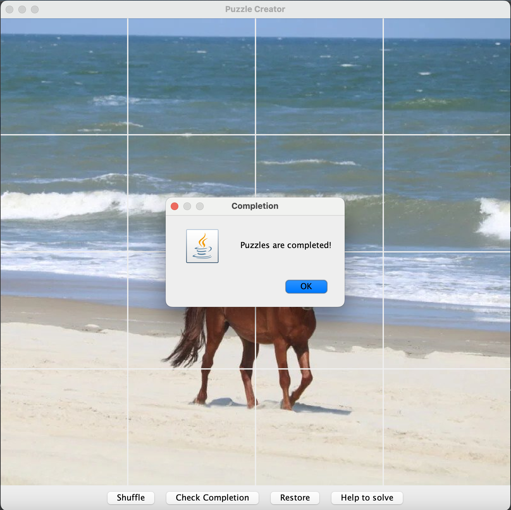
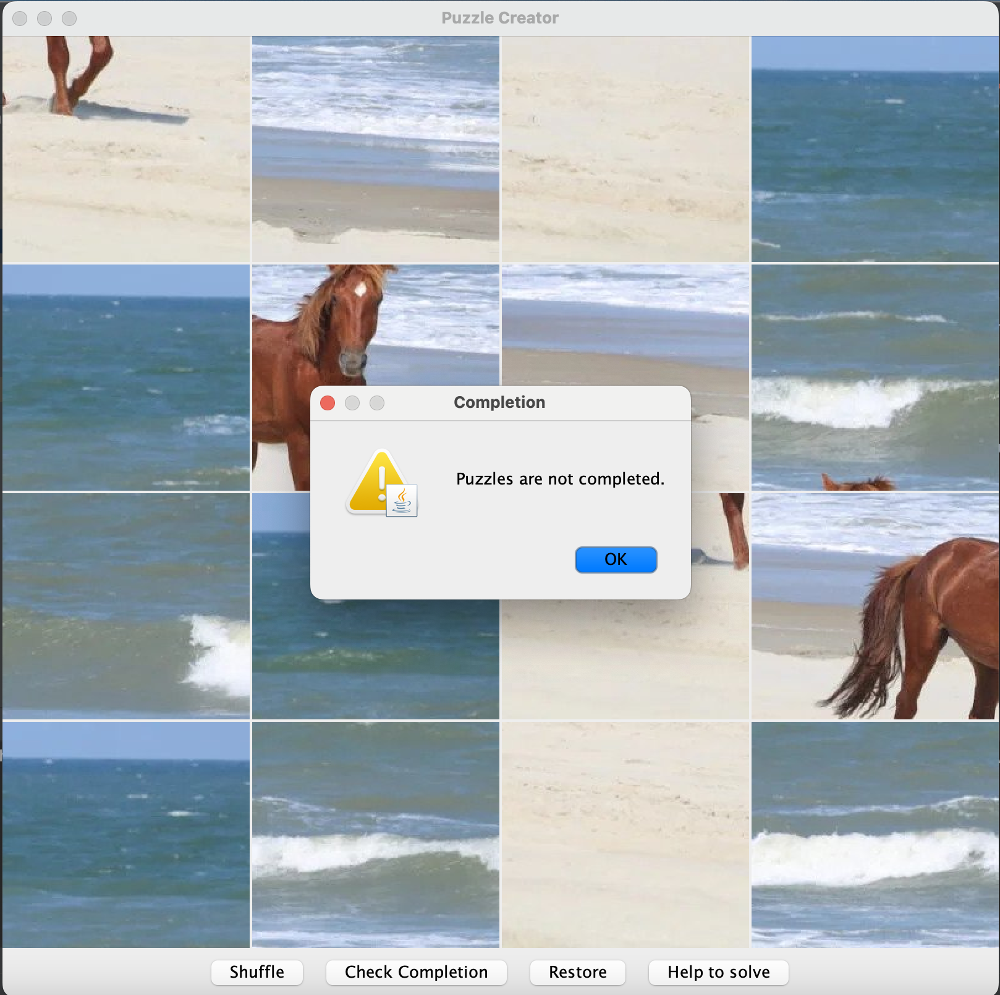
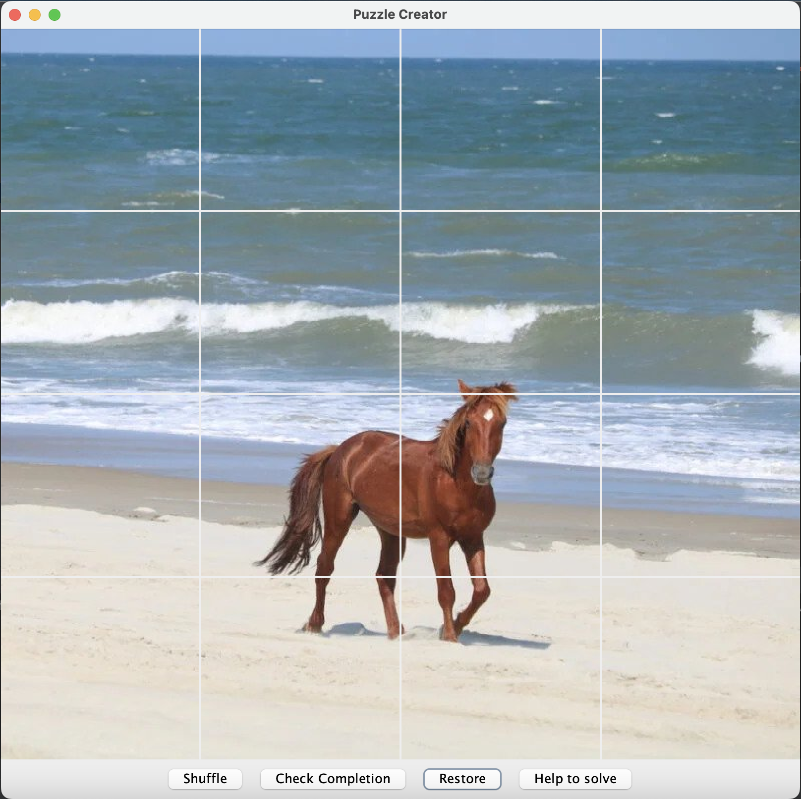
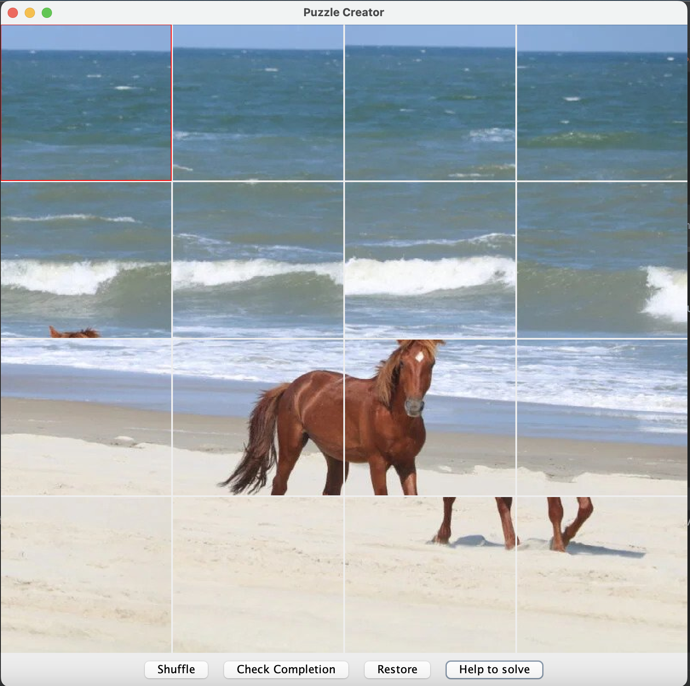

# Puzzle game
### 📗 ***Project description***
```
A simple GUI puzzle solving game, with the ability to shuffle, solve and check if the puzzle is completed.
```
List of options available for users:
* User can move pieces, check if the puzzle is competed, shuffle it, restore the original picture and use puzzle helper.
* Shuffle button - will shuffle your puzzle, creating a random sequence of puzzle movable pieces.
* Check completion button - will check if current state of pieces are solved and the puzzles are solved.
* Restore button - will restore the current state of pieces to original picture.
* Help to solve - will try to solve the puzzle by aligning the pieces with similar colors on the edges of the pieces together.
<details><summary>Shuffle</summary>


</details>

<details><summary>Check Completion Success</summary>


</details>

<details><summary>Check Completion Fail</summary>


</details>

<details><summary>Restore</summary>


</details>

<details><summary>Help Solve</summary>


</details>

### 🔨 ***Project launch:***

1. Clone this project to your IDE as Maven project.
2. Open pom.xml and reload all maven projects.
3. Run the program

### 🧰 Application technologies:
* **[JDK 11 or higher](https://www.oracle.com/cis/java/technologies/javase/jdk11-archive-downloads.html)**
* **[Apache Maven](https://maven.apache.org/download.cgi)**
* **[Java Swing](https://www.javatpoint.com/java-swing)**
* 

